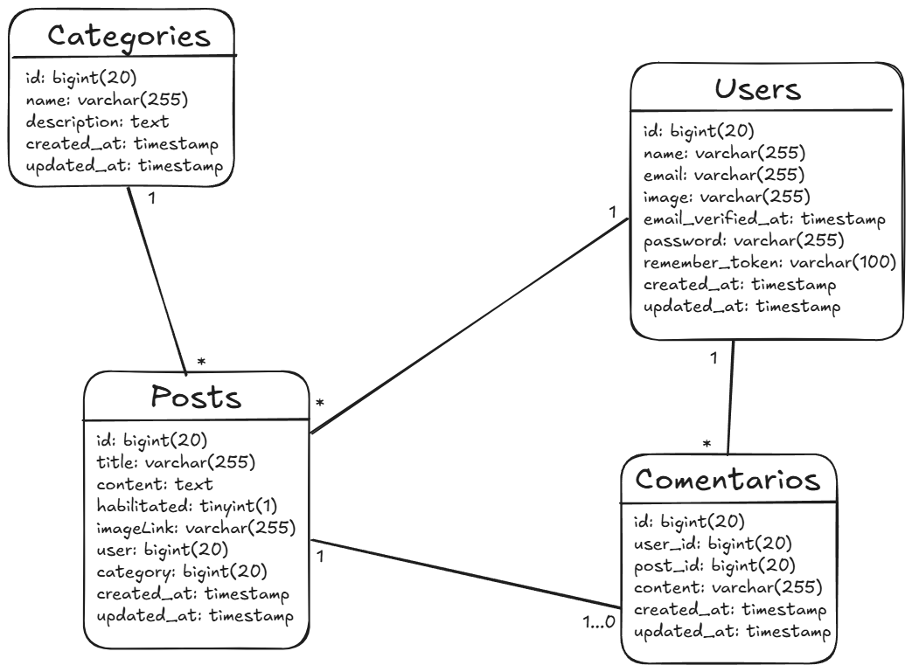
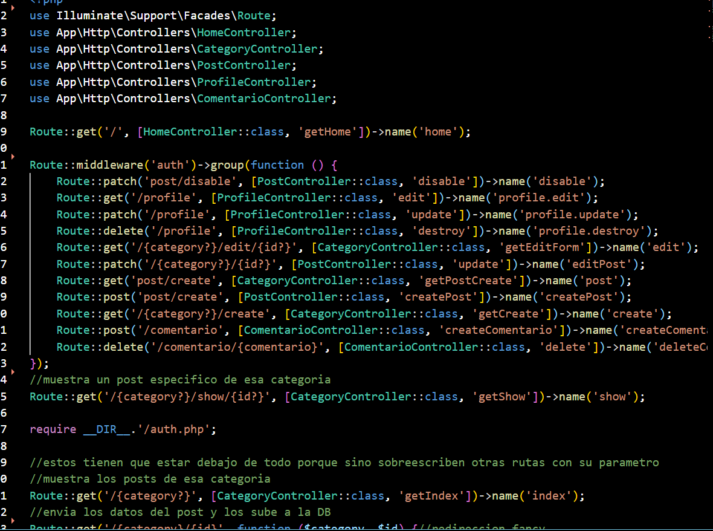
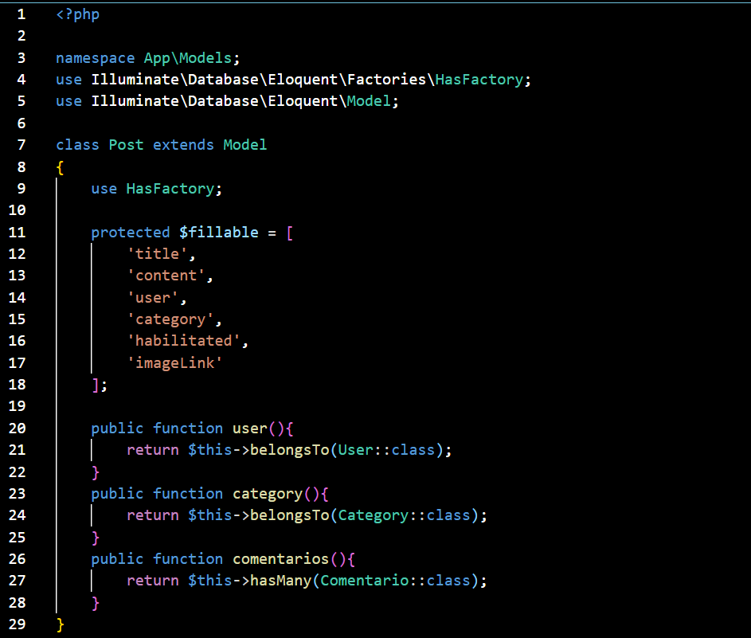
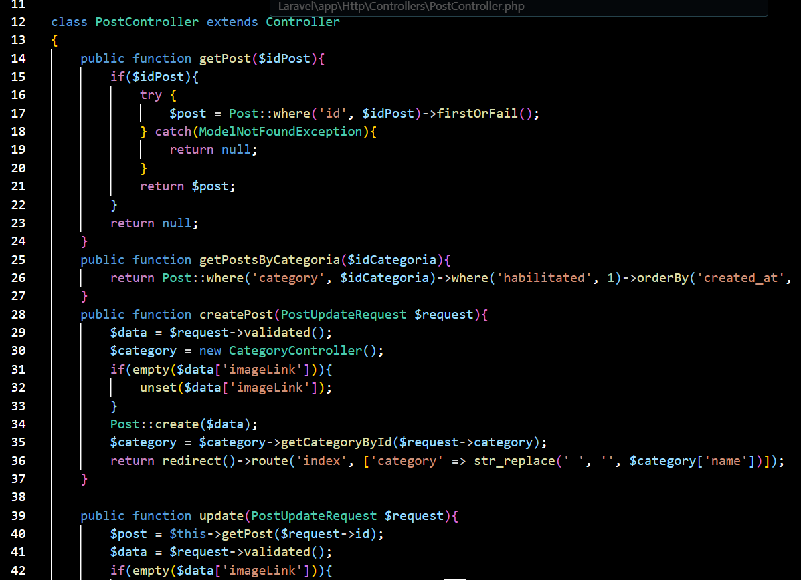

<div align="center">

<h3>Programación Web Avanzada 2025</h3>

<h1>Trabajo Práctico N°3 - Framework: Laravel</h1>
<br><br>


<br>

</div>

---

<h2>Grupo Piedra</h2>

<h3>Integrantes:</h3>

- Rossi Julia FAI-2378
  
- Lores Federico FAI-2948
  

---

<h3>Dominio</h3>

La página es un blog personal sobre el juego project sekai colorful stage ft. Hatsune Miku (también conocido como Hatsune Miku colorful stage) un popular juego de ritmo el cual incorpora 20 personajes originales los cuales están divididos en 5 grupos (Leo/need, More More Jump!, Vivid BAD SQUAD, Wonderlands x Showtime y 25-ji, nightcord de.) cada grupo es acompañado de los mismos 6 Vocaloids (Hatsune Miku, Kagamine Rin, Kagamine Len, Megurine Luka, MEIKO y KAITO) los cuales tienen su propio grupo llamado Virtual Singers.

---

<h3>Estructura</h3>
La base de datos está estructurada con las siguientes tablas
<h4>Modelo</h4>

- Categories: Definen la estructura principal de la página.

- Users: Las personas registradas en la página.
  
- Posts: Creados por los usuarios.
  
- Comentarios: Creados por los usuarios, existen dentro de un post.

         

<h4>Controladores</h4>

- Home: método que busca y envía los datos necesarios al home.
  
- Categoría: métodos para buscar y enviar los datos necesarios de cada vista.
  
- Post: métodos para buscar, crear, actualizar y borrar lógicamente
  
- Comentario: métodos para buscar, crear y borrar comentarios.
  
- Profile: métodos para buscar, editar y borrar un usuario, creado por laravel.
  
- Auth: es una carpeta con varios controladores que manejan la lógica de registro de usuario, login y autenticación, creados por breeze.

<h4>Páginas</h4>

- Home: Página principal, muestra los últimos 10 posts. Si hay errores en otras páginas redirigen a esta y muestra el mensaje de error.
  
- Category: Página creada dinámicamente según la base de datos. Muestra una categoría y todos sus posts, mostrando los últimos primero.
  
- Category/create: Formulario de creación de un post para una categoría específica. “post/create” cumple la misma función pero permite crear para cualquier categoría.
  
- Category/show: Acompañado de un id X, muestra el post con el id X.
  
- Category/edit: Acompañado de un id X, muestra el formulario para editar el post con el id X.

<h3>Ejemplos de referencia del codigo</h3>


<div align="center">
  
  
</div>

---


<h3>Guía de instalación</h3>

Para poder ejecutar este proyecto se requieren las siguientes herramientas:

- Un editor de código, recomendamos [Visual Studio Code](https://code.visualstudio.com/)

- [Git](https://git-scm.com/), el sistema de control de versiones

- [Node.js](https://nodejs.org/en), un entorno JavaScript

- [PHP](https://www.php.net/manual/es/install.php), el lenguaje de desarrollo utilizado

- [Composer](https://getcomposer.org/), una herramienta de gestión de dependencias en PHP

- [XAMPP](https://www.apachefriends.org/es/index.html), sistema de gestión de bases de datos MySQL, servidor web Apache y los intérpretes para lenguajes de script PHP

<br>

Una vez instaladas las herramientas ejecutar el editor de codigo, abrir una terminal y seguir los pasos:

<br>

1. Ubicar la terminal en el directorio deseado para instalar el proyecto y clonar el repositorio ejecutando en consola el comando:

```bash
git clone https://github.com/JuliaRossiFAI-2378/PWA-TP3-Laravel.git
```

2. Acceder a la carpeta donde se instaló el proyecto con el comando:

```bash
cd PWA-TP3-Laravel
```

3. Instalar las dependencias de composer necesarias para el proyecto ejecutando el comando:

```bash
composer install
```

4. Instalar las dependencias de node necesarias para el proyecto ejecutando el comando:

```bash
npm install
```

5. Configurar el archivo <i><b>.env</b></i>, para esto se recomienda copiar el archivo <i><b>.env.example</b></i> pegarlo en la raíz del proyecto y cambiarle el nombre a <i><b>.env</b></i>. Para hacer esto ejecutar el comando:

```bash
cp .env.example .env
```

6. Generar la clave de la aplicación:

```bash
php artisan key:generate
```

7. Abrir el panel de XAMPP e iniciar Apache y MySql.

8. Migrar la base de datos ejecutando el comando:

```bash
php artisan migrate
```

9. Laravel pregunta si desea crear la base de datos, conteste:

```bash
yes
```

10. Poblar la base de datos:

```bash
php artisan db:seed
```

<br>
<br>

<h3>Guía de ejecución</h3>

<br>
<br>

1. Con una terminal en el directorio del proyecto (queda ubicada ahí al finalizar la guía de instalación) ejecutar el comando:

```bash
composer run dev
```

2. Ir a una de las siguientes direcciones en el navegador para poder visualizar el sitio:

```bash
http://127.0.0.1:8000/
```
o

```bash
localhost:8000/
```

3. En caso de necesitar reestablecer la base de datos desde cero con el poblamiento por defecto, utilizar el siguiente comando:

```bash
php artisan migrate:fresh --seed
```

---

<h3>Mejoras Posibles</h3>

- Agregar un sistema de roles, donde se separen los permisos de un usuario normal y un administrador.
  
- Agregarle posibilidad a los administradores de crear, editar y borrar categorías. Aunque cargamos dinámicamente las categorías desde la base de datos, actualmente no hay manera de manejar su CRUD.
  
- Agregar verificación por correo.
  
- Agregar un layout diferente, junto con estilizado de cada elemento, para cada categoría.
  
- Agregar comentarios que responden a otros comentarios en vez del post.
  
- Agregar imágenes por defecto según la categoría. 


---
<h3>Tecnologías utilizadas</h3>

<table>
    <tr>
        <td><b>Nombre</b></td>
        <td><b>Versión</b></td>
        <td><b>Descripción</b></td>
        <td><b>Link</b></td>
    </tr>
    <tr>
        <td>Laravel</td>
        <td>12.0</td>
        <td>Framework PHP</td>
        <td>https://laravel.com/</td>
    </tr>
        <tr>
        <td>Tailwind</td>
        <td>4.1.7</td>
        <td>Librería de CSS</td>
        <td>https://tailwindcss.com/</td>
    </tr>
</table>
